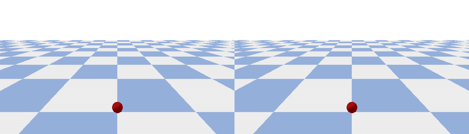

# MIRAGE-V: A Taxonomy-Driven Benchmark for Physics Verification in Videos

MIRAGE-V is a benchmark for **physics verification and temporal reasoning in videos**.  
It evaluates whether video reasoning models can **detect subtle physical inconsistencies**—such as brief temporal discontinuities, occlusion-induced identity swaps, latent physical property changes, and conservation-law violations—rather than relying on static shortcuts or visual priors.

The benchmark is built from **minimal-change paired videos**: for each example, two clips (A/B) differ by a *single controlled intervention* that flips the correct answer. This design enables **diagnostic evaluation** via both accuracy and **pair accuracy**, exposing failures that are invisible under standard metrics.

---

## 📄 Paper

**MIRAGE-V: A Taxonomy-Driven Benchmark for Physics Checking in Videos**

- 📄 PDF: [`paper/main.pdf`](paper/main.pdf)

The paper describes:
- the motivation for physics-checking benchmarks,
- the MIRAGE-V taxonomy,
- dataset construction,
- evaluation protocol,
- and empirical results showing that **even frontier models struggle on several MIRAGE-V taxonomies**, particularly those requiring fine-grained temporal discrimination.

---

## 🎞️ Example (Minimal-Change Pair)

Below is a representative MIRAGE-V example from the **TR-ALI (Temporal Aliasing)** taxonomy.

**Left:** clip A (physically consistent motion)  
**Right:** clip B (brief micro-teleport)



This example illustrates how two videos can appear nearly identical while differing by a subtle temporal violation that is easy to miss under sparse frame sampling.

Additional example videos and GIFs are provided in the `examples/` directory.

---

## 🧠 Taxonomy

MIRAGE-V is organized around a **failure-mode taxonomy**. Each example belongs to exactly one taxonomy module.

Current modules include:

- **TR-ALI** — Temporal aliasing (brief discontinuities, micro-teleports)
- **TR-ORDER** — Event ordering (which event happened first)
- **TM-ID** — Identity tracking under occlusion
- **P-OCC** — Hidden obstacle / collision behind occlusion
- **C-CHAIN** — Multi-step causal chains
- **R-COUNT** — Relational event counting
- **PH-LATENT-FRICTION** — Latent friction inference
- **PH-LATENT-MASS** — Latent mass inference
- **PH-INVAR-ENERGY** — Conservation / energy gain violations
- **PH-COUNTER** — Counterfactual physical reasoning

The taxonomy is **extensible**: new modules can be added by defining a generation template and corresponding questions.

---

## 🧱 Repository Structure
```
├── code/
│ ├── generator/ # Video pair generation (PyBullet / synthetic)
│ ├── benchmark/ # Evaluation harness + model adapters
│ └── realedit/ # (Optional) Real-video editing utilities
├── paper/
│ └── main.pdf # MIRAGE-V paper
├── examples/
│ └── pair_TR-ALI_0000_A_vs_B.gif
├── data/ # Generated datasets (not checked in)
├── runs/ # Benchmark outputs (not checked in)
└── README.md
```

---

## ⚙️ Installation

We recommend Python ≥ 3.9.

### Generator dependencies
```bash
pip install -r code/generator/requirements.txt
```

### Benchmark dependencies
```bash
pip install -r code/benchmark/requirements.txt
```

### Or install everything:
```bash
pip install -r requirements-all.txt
```
---
## 🧪 Generating Data
MIRAGE-V data consists of paired MP4 videos + JSONL annotations.

To generate a synthetic dataset using the built-in PyBullet generator:

```bash
python code/generator/generate_miragev.py \
  --out_root data/miragev_synth \
  --pairs_per_taxonomy 50 \
  --fps 30 \
  --sim_hz 240 \
  --seed 0
```
This creates:
```
data/miragev_synth/
├── videos/
│   └── <MODULE>/pair_<ID>_{A,B}.mp4
└── annotations/
    ├── miragev.jsonl
    └── pair_meta/
```
---
## 📊 Running Evaluation
The evaluation harness supports:
- Open-weight models (via Hugging Face, frame-based)
- API models (OpenAI, Gemini)
- Native video or frame-sampling protocols


Example (Hugging Face model, frame sampling):
```bash
python code/benchmark/evaluate.py \
  --dataset data/miragev_synth/annotations/miragev.jsonl \
  --adapter hf \
  --model_name_or_path Qwen/Qwen2.5-VL-7B-Instruct \
  --mode full_video \
  --num_frames 8 \
  --video_root data/miragev_synth \
  --out_dir runs/qwen25vl_7b
```
Example (OpenAI, frame-based):
```bash
python code/benchmark/evaluate.py \
  --dataset data/miragev_synth/annotations/miragev.jsonl \
  --adapter openai \
  --openai_model gpt-5.2 \
  --mode full_video \
  --num_frames 8 \
  --video_root data/miragev_synth \
  --out_dir runs/gpt-5.2
```
---
## 📦 Data Format
### Dataset (miragev.jsonl)
Dataset (miragev.jsonl)
```
{
  "example_id": "...",
  "pair_id": "...",
  "pair_role": "A" | "B",
  "module": "TR-ALI",
  "question_type": "yesno" | "mcq",
  "prompt": "...",
  "options": ["A", "B", "C"],
  "answer_index": 0,
  "video_path": "videos/TR-ALI/pair_xxx_A.mp4",
  "critical_window": [1.2, 1.5]
}
```
---
## 📈 Outputs
Each evaluation run writes:
- predictions.jsonl: One JSON line per example, including:
  - raw model output
  - parsed prediction
  - correctness flag
- metrics.json: Aggregate metrics:
  - accuracy
  - pair accuracy
  - per-taxonomy breakdowns
- run_config.json: Full CLI configuration used for the run

These files live under: `runs/<run_name>/`
---
## 🔌 Adding a New Model Adapter
Model adapters live in: `code/benchmark/miragev/models/`

To add a new model:
1. Subclass ModelAdapter
2. Implement predict(...)
3. Register the adapter via the registry
4. Add a CLI option in `evaluate.py`
Adapters can operate on:
- sampled frames (images)
- full video paths (video_path)
- or text-only inputs

---
## 🧩 Contributing New Data or Taxonomies
To add a new taxonomy module:
1. Define a generation template (synthetic or real-video)
2. Specify minimal A/B intervention
3. Add questions + answer rules
4. Register the module in the generator
5. Add example GIFs under examples/

Contributions that expand physical phenomena, occlusion complexity, or temporal difficulty are especially welcome.

---
## 📜 License
Apache 2.0.
See LICENSE for details.